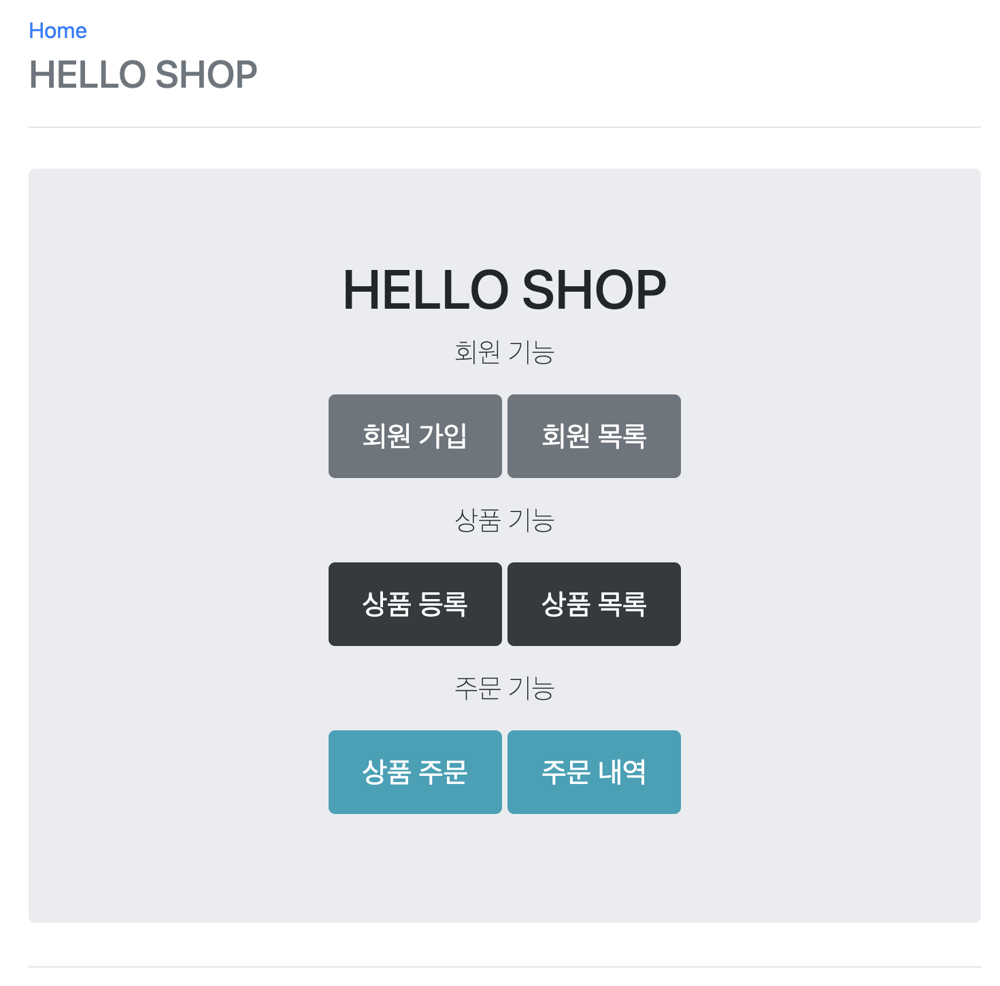
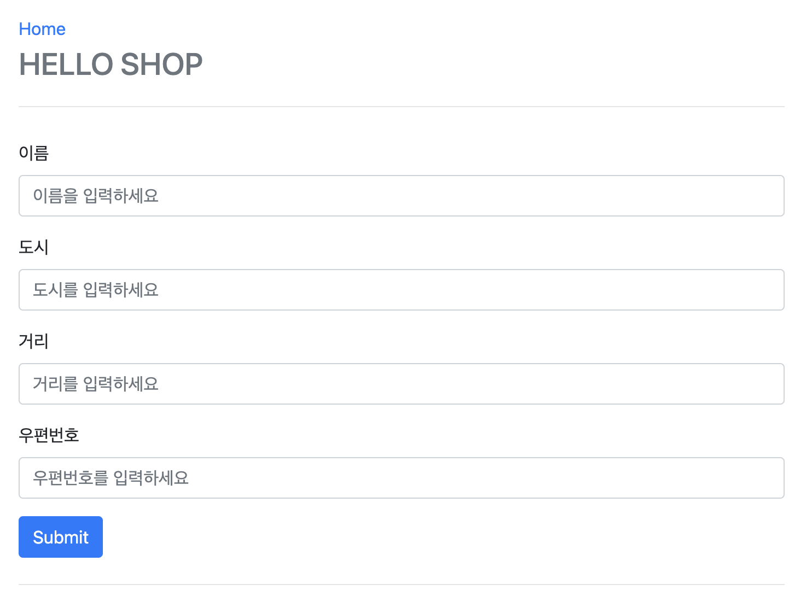
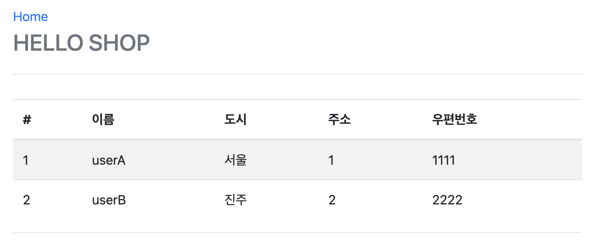
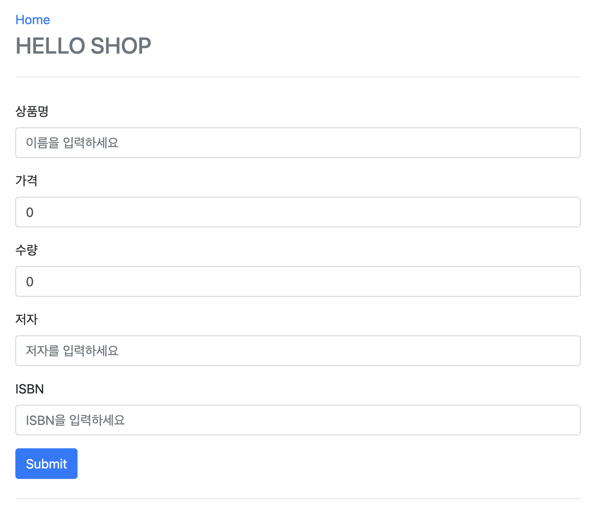
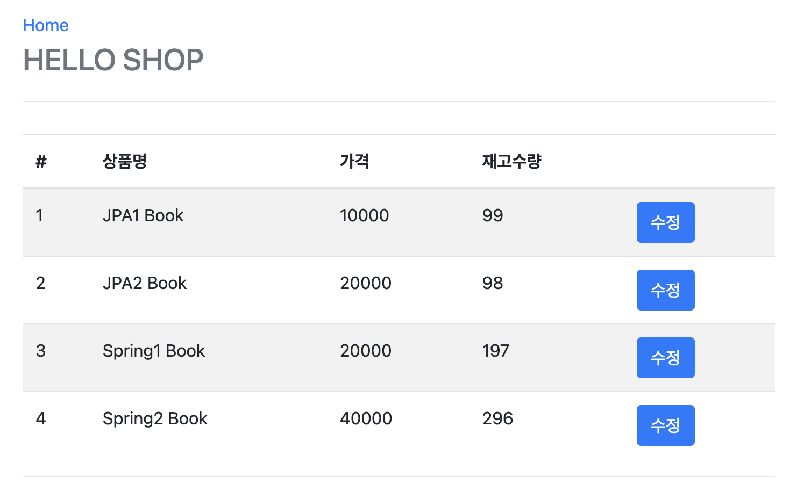
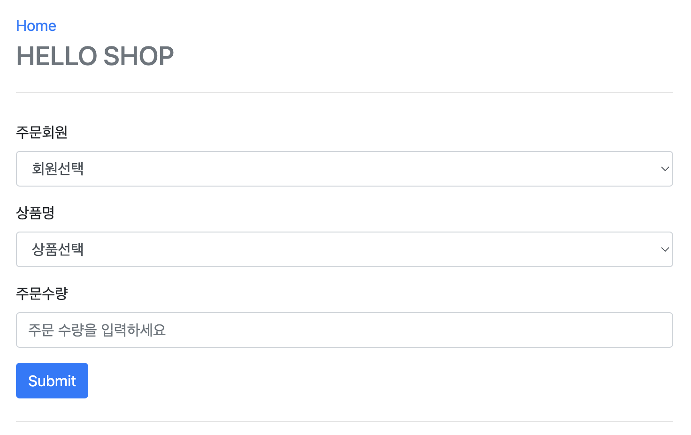
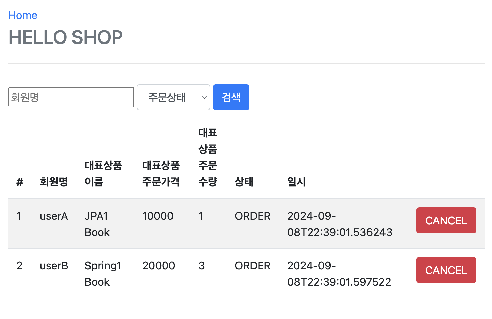

# Project Overview

This project aims to demonstrate the practical application of Spring Boot and JPA in real-world scenarios. Even though these technologies are widely known, implementing them to design and develop web applications in a professional setting involves multiple complexities.

## Typical Web Application Development Process

1. Requirement Analysis
2. Domain and Database Design
3. Architecture Setup
4. Core Business Logic Implementation
5. Web Layer Development
6. Testing
7. Performance Optimization

This project goes beyond simple examples and tackles complex situations that can arise in real-world environments. It covers the entire process, including requirement analysis, design, development, testing, and performance optimization. By following the project from start to finish, the correct use of Spring Boot and JPA in a production-grade application becomes more intuitive, especially regarding how to handle performance tuning step by step.

The project is divided into two main parts:
1. **Part 1: Web Application Design and Development**
2. **Part 2: API Development and Performance Optimization**

## Key Features

### Part 1 - Web Application Development

The first part focuses on designing and developing a web application with user registration, product management, and order processing. The development steps include:

1. **Project Setup:** Create the project and configure Spring Boot, JPA, Thymeleaf (for view templates), Lombok, and the database.
2. **Domain Analysis and Design:** Analyze requirements, design domains and tables, and map entity classes to database tables using JPA.
3. **Domain Development:** Implement core business logic for users, products, and orders, and validate functionality through test cases.
4. **Web Layer Development:** Develop controllers and Thymeleaf templates to provide the web interface, allowing interaction with the domain.

### Part 2 - API Development and Performance Optimization

In the second part, the focus shifts to developing REST APIs and optimizing their performance. Nowadays, rather than using server-side templates to generate HTML, it's common to return JSON data via APIs. This project covers best practices for designing APIs with Spring Boot and JPA while addressing performance challenges.

1. **API Development Basics:** Build basic CRUD REST APIs for registration, updates, and retrieval.
2. **Advanced API Development:** Understand key considerations when building query-based APIs with JPA, handle lazy loading issues, and apply incremental performance optimizations.
3. **Essential Optimizations:** Address common performance pitfalls in production environments when using Spring Boot and JPA, such as issues related to OSIV (Open Session in View).

## Project Goals

The project is designed to move beyond basic feature development and focus on solving technical challenges. By the end, you will have learned how to implement APIs efficiently, tackle real-world performance bottlenecks, and understand best practices for using JPA in complex queries.

### Proper API Implementation

When developing APIs using JPA, questions such as whether to expose entities directly or return separate DTOs (Data Transfer Objects) come into play. This project demonstrates how to handle these issues safely and efficiently for long-term maintenance.

### Extreme Query Performance Optimization with JPA

In real-world applications, querying data from multiple joined tables while ensuring fast performance is a common challenge. The project includes several complex scenarios, such as querying large collections of data and handling pagination, and explains how to optimize them with JPA.

### Six Steps to Performance Tuning

The project is divided into six stages of performance tuning to address bottlenecks in API development. By following these steps, you will gain a clear understanding of how to analyze and optimize API performance incrementally, similar to real-world situations.

### Solving 90% of Real-World JPA Performance Issues

The project covers common JPA performance issues encountered in real-world scenarios. Developers often struggle with performance issues toward the end of a project due to incorrect use of JPA, but this project demonstrates how a few adjustments to JPA query options and code can drastically improve performance.

## Key Sections

1. **API Development Basics:** Build basic CRUD REST APIs.
2. **Advanced API Development:** Learn best practices for JPA-based API queries, including solutions to lazy loading issues and performance optimizations.
3. **Critical Optimizations:** Ensure optimal performance by addressing common real-world challenges with Spring Boot and JPA, including tuning JPA query options.

## 1. Main Page
The main page of the application provides access to the different functionalities: member registration, product management, and order management.

## 2. Register Member
The member registration form allows you to add new members to the system by filling in their personal information such as name, city, street, and postal code.

## 3. List of Members
This page displays a list of registered members, along with their details like city and postal code.

## 4. Register Product
The product registration form allows you to add new products with details such as name, price, quantity, author, and ISBN.

## 5. Product List
This page shows the list of available products with options to edit the product details.

## 6. Order Product
The product ordering form allows users to place orders by selecting members and products, along with the desired quantity.

## 7. Order List
This page displays a list of placed orders, including details like product name, price, quantity, order status, and timestamp. There is also an option to cancel an order.

